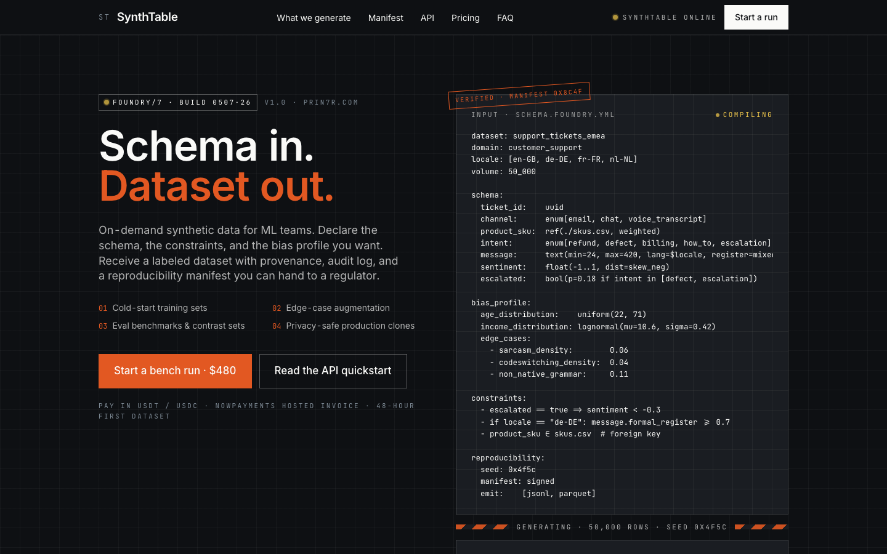
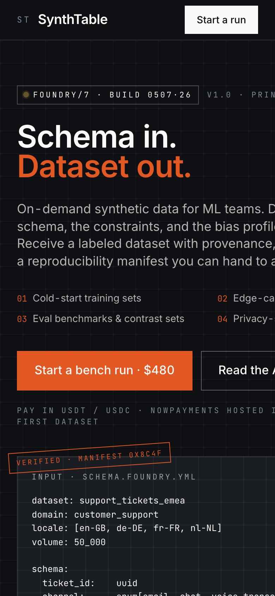

# Foundry/7 — Synthetic Data Factory

> Schema in. Dataset out. On-demand synthetic data for ML teams,
> with provenance, audit log, and a reproducibility manifest you can
> hand to a regulator.

- **Site**: https://synthetic-data-factory.prin7r.com
- **Notion opportunity**: [Synthetic data and datasets factory](https://www.notion.so/3543ceec26198128adc0dd52e37de741)
- **Stack**: Next.js 15 (App Router) + Tailwind + ShadCN-vendored primitives → SaaS app stub at `apps/app/` for a future wave
- **Payments**: NOWPayments hosted invoice (USDT/USDC + fiat-partner card on-ramp), HMAC-SHA512 IPN

---

## Repo structure

```
/
├─ apps/
│  ├─ landing/               Next.js 15 App Router landing
│  │  ├─ app/                routes (page.tsx, layout.tsx, api/*)
│  │  │  ├─ api/checkout/nowpayments     POST → hosted invoice
│  │  │  └─ api/webhooks/nowpayments     POST ← HMAC-SHA512 IPN
│  │  ├─ components/ui/      vendored ShadCN primitives (Button, Card)
│  │  ├─ lib/                env reader + NOWPayments helper + verifier
│  │  └─ tailwind.config.ts  brand tokens (graphite + sodium + ember)
│  └─ app/                   SaaS app placeholder (Wave-3 scaffold)
├─ docs/
│  ├─ 01-brand-identity.md
│  ├─ 02-architecture.md
│  ├─ 03-user-journeys.md
│  ├─ 04-pain-points.md
│  ├─ 05-audience-profile.md
│  ├─ 06-sales-channels.md
│  ├─ 07-sales-strategy.md
│  ├─ 08-marketing-strategy.md
│  ├─ 09-go-to-market.md
│  ├─ 10-pitch-deck.md
│  ├─ pitch-deck.html
│  └─ screenshots/
│     ├─ landing-desktop.png
│     └─ landing-mobile.png
├─ DESIGN.md                 15-section design system (root)
├─ Dockerfile.landing        multistage Next.js standalone
├─ docker-compose.yml        Traefik labels + env_file (.env)
├─ .env.example              public-shape env vars
├─ LICENSE                   MIT
└─ README.md                 this file
```

## Screenshots




## Development

```bash
cd apps/landing
pnpm install
pnpm dev   # → http://localhost:3000
```

## Deploy

The landing is deployed to `synthetic-data-factory.prin7r.com` via
`storage-contabo` (host-mode Traefik, Let's Encrypt resolver `letsencrypt`).

```bash
ssh storage-contabo
cd /opt/prin7r-deploys/synthetic-data-factory
git pull
docker compose build
docker compose up -d
```

The `.env` on storage-contabo carries live `NOWPAYMENTS_API_KEY` and
`NOWPAYMENTS_IPN_SECRET` (mirrored from `chatbot-agency`'s `.env`). The
compose file pulls those via `env_file: .env`.

## Brand identity (one-line)

**Foundry/7** is a *precision foundry* aesthetic: graphite + sodium-white +
carbon-orange ember + signal-yellow accents, Inter Display + JetBrains Mono.
Every page treats a schema declaration like the hero artifact it is.

Full brand pyramid in [`/docs/01-brand-identity.md`](docs/01-brand-identity.md);
all 15 design-system sections in [`/DESIGN.md`](DESIGN.md).

## License

MIT — see [`LICENSE`](LICENSE).
