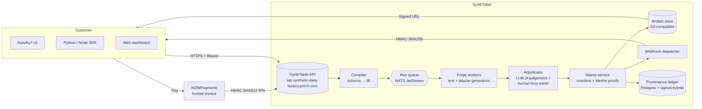

# 02 — Architecture

## System diagram

## Components

| Component       | Purpose                                                  | Stack |
|-----------------|----------------------------------------------------------|-------|
| Landing         | Marketing site + NOWPayments checkout                   | Next.js 15, Tailwind, ShadCN-vendored |
| API gateway     | Auth, rate limit, run lifecycle endpoints               | Bun + Hono (planned) |
| Compiler        | Parse YAML/JSON schema → typed IR; lint constraints     | Rust (planned), TypeScript shim today |
| Run queue       | Durable backpressure between API and workers           | NATS JetStream |
| Forge workers   | Generate records from IR; multi-model, GPU-bound         | Python + PyTorch + vLLM |
| Adjudicator     | LLM-of-judgement labeler + optional human panel routing | Python + Claude/Gemini APIs (read-only) |
| Stamp service   | Build + sign manifest, mint Merkle proofs, store artifacts | Go (planned) |
| Provenance ledger | Append-only signed events; row-level proofs            | Postgres + libsodium ed25519 |
| Webhook dispatcher | At-least-once delivery; HMAC signed                  | TypeScript + Redis Streams |
| Artifact store  | JSONL / Parquet datasets, signed download URLs           | S3-compatible (Cloudflare R2 default) |
| Billing         | Hosted invoices, IPN verification                       | Next.js API routes (Wave 2) → Wasp app (Wave 3) |

## Data flows

### Run lifecycle

1. Customer POSTs `schema.foundry.yml` to `/v1/runs`.
2. **Compile.** API calls compiler → typed IR + signed plan. Reject contradictory
   constraints inline (HTTP 422).
3. **Forge.** Plan posted to NATS; forge workers stream record batches into
   the artifact store as `partial.parquet`. Stream events out via WS/SSE.
4. **Adjudicate.** Sample 0.5–2% into adjudicator. Re-roll failed rows. For
   gated verticals (medical, legal, fintech), route through human panel
   queue.
5. **Stamp.** Compute Merkle root over row proofs, write manifest, sign with
   the foundry key. Emit `run.completed` to the customer's webhook.
6. **Customer downloads** dataset using a signed URL good for 24h.

### Payments path

1. Landing POSTs `/api/checkout/nowpayments` with `{plan: "bench"|...}`.
2. Server creates a NOWPayments hosted invoice (USD price, USDT/USDC pay
   currencies). API key never leaves the server.
3. Customer redirected to `invoice_url`.
4. NOWPayments POSTs IPN to `/api/webhooks/nowpayments`. Body verified with
   HMAC-SHA512 over the alphabetically sorted JSON, using the IPN secret.
5. Verified `finished`/`confirmed` payment → balance credit (today: log line;
   Wave 3: a write into `payments` table). Customer redirected back to
   landing with `?status=paid`.

## Deploy topology (Wave 2)

| Domain                                       | Layer        | Host             | Notes |
|----------------------------------------------|--------------|------------------|-------|
| `synthetic-data-factory.prin7r.com`          | Landing      | storage-contabo  | Traefik (host net) → docker container, LE TLS |
| (planned) `api.synthetic-data-factory.prin7r.com` | API gateway | TBD (Wave 3 — Hetzner GPU host) | |
| (planned) `forge-*.synthetic-data-factory.prin7r.com` | Forge workers | TBD (Wave 3) | GPU pool |

For Wave 2, only the landing is live. API + workers + adjudicator land in
Wave 3 alongside `apps/app/`.

## External dependencies

- NOWPayments (Wave 2 active) — hosted invoice + IPN
- Plisio (Wave 3 forward-compat)
- Claude / Gemini APIs (Wave 3, adjudication only — never generation)
- Cloudflare R2 (Wave 3 artifact store)
- Sentry (errors), Plausible (analytics) — to be wired in Wave 3
